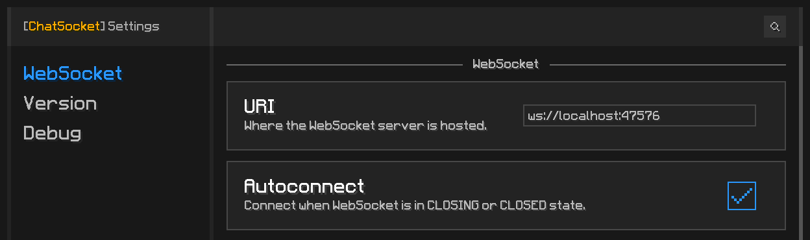

# ChatSocket

**A ChatTriggers module**\
Configure and open a WebSocket connection to send and receive ChatTrigger events in real time.

ChatSocket enables you to interact with Minecraft programmatically **without modifying its internal code**, using **WebSocket communication** to exchange messages with external programs.

## Installation

1. Install [ChatTriggers](https://github.com/ChatTriggers/ChatTriggers/releases)
2. Download `Source code.zip` from [Releases](https://github.com/Khoeckman/ChatSocket/releases/latest)
3. Extract `Source code.zip` into `%appdata%/.minecraft/config/ChatTriggers/modules/ChatSocket`
4. Make sure the `metadata.json` file is located at `%appdata%/.minecraft/config/ChatTriggers/modules/ChatSocket/metadata.json`
5. Reload all ChatTrigger modules with `/ct load`.
6. In chat should appear: `[CS] Module Loaded. Type "/cs" for help.`

## Architecture

**Client** (Minecraft + ChatSocket) ↔ **Server** (WebSocket server) ↔ **Controller** (Any program connected to the Server)

Clients and controllers can only communicate if they connect to the same server and use the same channel.

## Setup Server

### Environment Variables

Configure the WebSocket server with the `.env` file located in `./WebSocketServer/.env`:

| Variable     | Type   | Default | Description                                                                                     |
| ------------ | ------ | ------- | ----------------------------------------------------------------------------------------------- |
| `WSS_PORT`   | Number | `47576` | The port on which the WebSocket server listens.                                                 |
| `WSS_SECRET` | String | _None_  | Secret key for authenticating incoming connections. Throws a `TypeError` if missing or invalid. |

### Start the Server

1. Open a terminal.
2. Navigate to the server directory: `cd WebSocketServer/`
3. Install dependencies and start the server:

```bash
npm install
npm run wss
```

On success the terminal will print: _ChatSocket server running on ws://localhost:47576_

## Minecraft Setup

In Minecraft (Forge 1.8.9), run `/cs settings` to open the ChatSocket settings GUI. Make sure the `URL` is set to your WebSocket server address.

You must also select a **Channel**. Think of it like a radio frequency: your Minecraft client can only be set to one channel at a time. To communicate, every controller or external client you want to interact with must connect to the same server and use the same channel. If they are on different channels, they will not receive each other's messages.



## Connecting External Clients

Refer to the `ChatSocketController/` directory for a demo. You can use this as a starting point to build your own external programs that connect to the ChatSocket server. That way it can communicate with Minecraft clients in real time.
Making changes to this program does not require you to reload or modify anything inside Minecraft, saving time.

## Credits

This module contains modified code from:

1. [Vigilance - By FalseHonesty](https://chattriggers.com/modules/v/Vigilance)
2. [WebSocket - By Debug](https://chattriggers.com/modules/v/WebSocket)

## Devdependencies

[CTAutocomplete - By lotymax](https://chattriggers.com/modules/v/CTAutocomplete)

Run `/ct import CTAutocomplete` in Minecraft to enable this dependency. Only required if you plan to play around with the ChatTriggers code.
